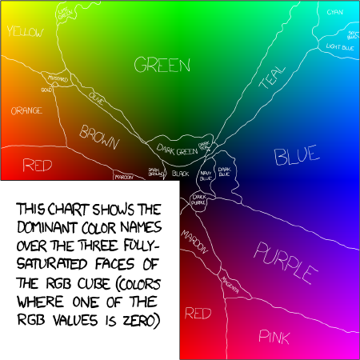
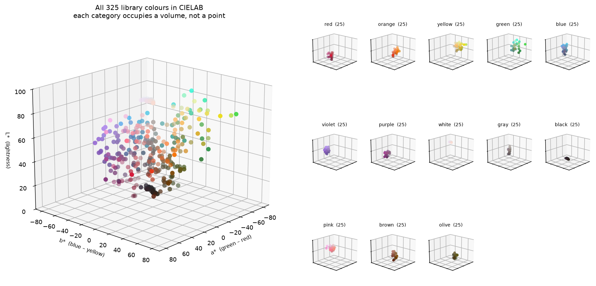
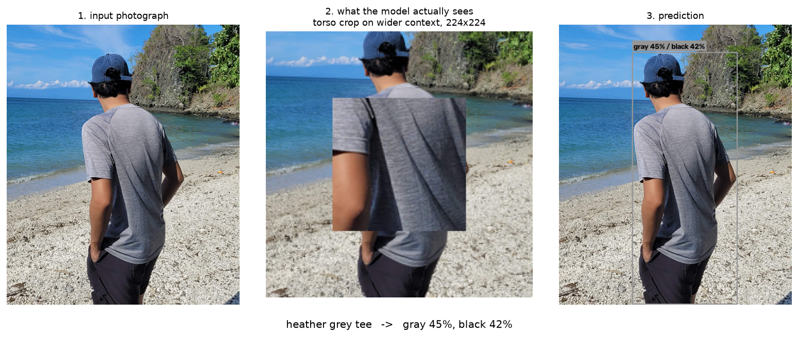
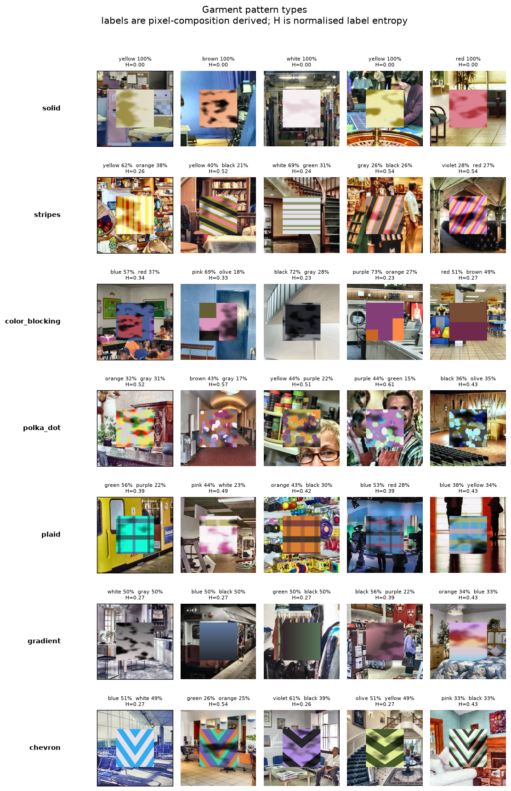
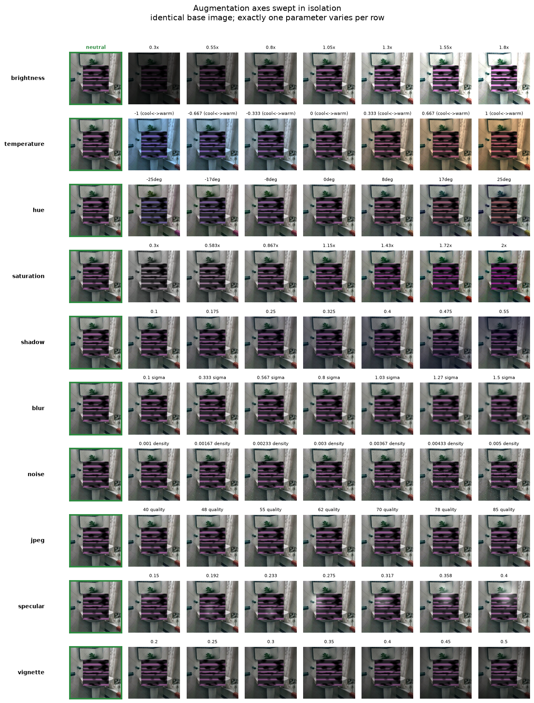
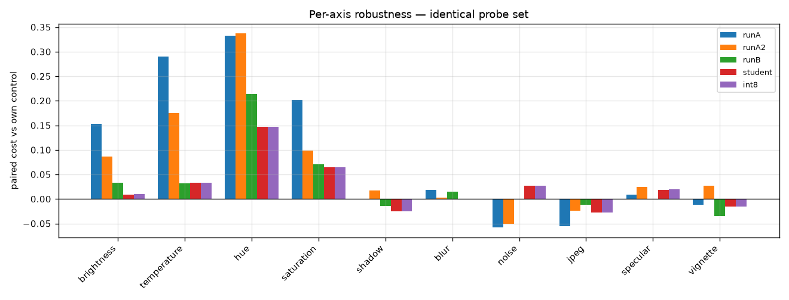
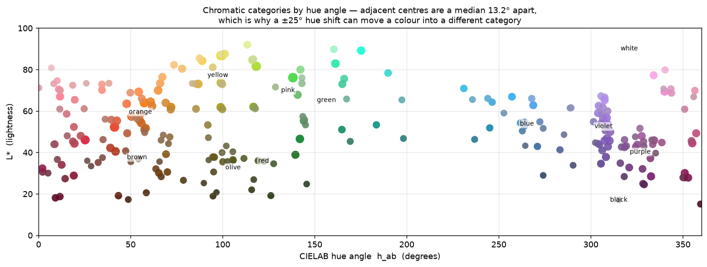
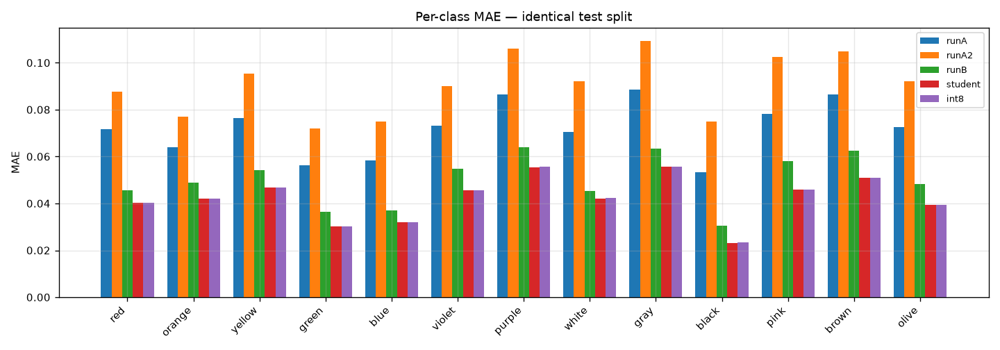
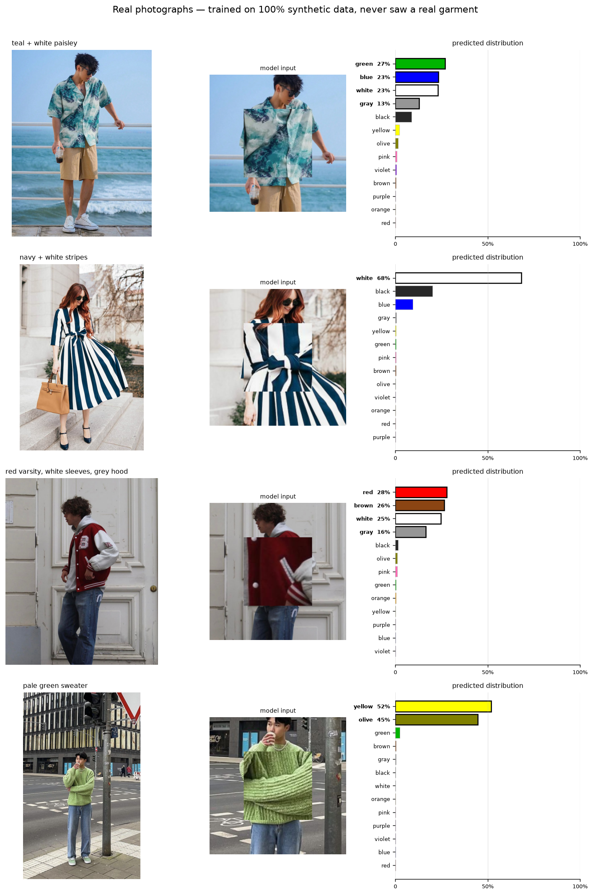
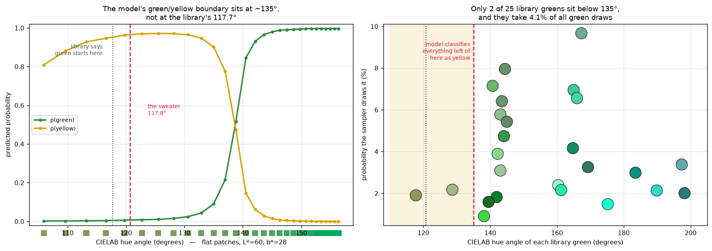

# Clothing Color Recognition with Synthetic Data

**[Live demo](https://huggingface.co/spaces/giosanchez0208/clothing-color-recognition)** · **[Model](https://huggingface.co/giosanchez0208/clothing-color-recognition)** · **[Results](docs/results.md)**

**"Just use the eyedropper tool!"** you might be telling me. Let me be the first to tell you that it's not that easy.

---

## Inspiration

This idea came to me in a discussion with my colleagues from my previous job. We were discussing shirt colors (it was relevant to our work) and touched on the ambiguity in how different people categorize colors.

Of course, I went digging on the internet. That's when I came across Randall Munroe's [XKCD Color Survey](https://blog.xkcd.com/2010/05/03/color-survey-results/). This was my first exposure to the problem of human vs computer color categorization. 



However, this graph is restricted to the saturated faces of the RGB cube. So I couldn't use their database to categorize lighter colors like pastels and off-whites.

I did some more digging, and found the [ISCC-NBS Level 3 color system](https://www.munsellcolorscienceforpainters.com/ISCCNBS/ISCCNBSSystem.html). This one was clearer and more systematic. There are 13 main categories for colors:

`red` `orange` `yellow` `green` `blue` `violet` `purple` `white` `gray` `black` `pink` `brown` `olive`

along with modifiers such as *dark*, *brilliant*, *greenish*, and so on. The best part is that it covers the whole spectrum of colors. This is good news. We have a standardized list of colors we can use to categorize colors that also align with human perception.

The important thing to note is that there is a **base color which is modified**. The base color is what I analyzed, and I found that they occupy a certain *area*.

The CIELAB color space was used for this analysis because it corresponds more to "perceived color spaces." Since the purpose of this project is related to perception, it only made sense to use a relevant framework.



Eyes to the panels on the right. Every category is a **volume**, not a point. This is what surfaces the nature of the problem.

---

## "I still haven't changed my mind. You can still use the eyedropper tool and just find the closest color."

I would agree if you positioned this person under perfect conditions. Adequate lighting and a perfect camera.

But reality, more often than not, does not have those conditions.

Under an orange streetlamp, the color you might pick up from a shirt might be apricot. And in dim lighting, navy blue appears black. Where do you even draw the lines between white, gray, and black? Variables such as brightness, variations in warmth, and so on also affect our perception of colors.

We, as humans, have learned to adjust our perception of colors based on the environment.

**Can the same be taught to a model?**

That's the question I wanted to answer.

## "Well, that doesn't sound like a difficult problem. Can't we just train a model on an existing database?"

If such a database exists, of course. Unfortunately, like a lot of computer vision problems, resources are few and far between. Especially for a problem as specific as this. However, this isn't new to me. In my previous job, I've worked extensively with problems where there simply aren't enough datasets. Sometimes going out into the field myself and taking my own photos. Other times, compiling and re-labeling existing datasets. In this case, however, I decided to take a synthetic data approach.

Now, we could go into Blender and create a bunch of assets. That can even be done programmatically. But as with much of my work, I wanted to try something a lot more lightweight.

---

## Summary

The [live demo](https://huggingface.co/spaces/giosanchez0208/clothing-color-recognition) runs both models client-side, the color model through ONNX Runtime Web and torso detection through MediaPipe Pose, so nothing you point the camera at leaves your machine. The color model measures around 25 ms per frame in WebAssembly, against 6.9 ms for the same weights natively.

I built a system that predicts a **probability distribution over 13 color categories** instead of picking one label and committing to it. It was trained on **28,860 procedurally generated images** that try to imitate the kind of data my pipeline needs to predict a real-world shirt color.

The final model is **4.2 MB** and runs a forward pass in **6.9 ms on CPU**.

| | KL divergence | top-1 | size | CPU |
|---|---:|---:|---:|---:|
| Teacher, ResNet-50 | 0.6226 | 63.2% | 90.1 MB | 45.4 ms |
| **Student, MobileNetV3-Small INT8** | **0.4800** | **67.4%** | **4.2 MB** | **6.9 ms** |

The student is **21× smaller, 6.6× faster, and better than its teacher on every one of the 13 categories.** That result surprised me the first time and it surprised me again when I reproduced it on a properly partitioned test set.

Two ideas do most of the work here.

**Soft labels.** Most color classifiers use hard labels. For example, if it declares "this shirt is blue" then that's all the information it has. Not "I'm confident that it's blue, but it could be another color" or "It's blue, and there are other colors." Just blue. This one is trained on distributions derived from actual pixel composition, using KL divergence as the loss. That buys two things: a striped shirt can come back `blue 60%, white 40%` instead of being forced to choose, and a genuinely ambiguous garment can come back `gray 45%, white 35%` and *say* it's uncertain rather than guessing confidently. This is an instance of [Label Distribution Learning](https://palm.seu.edu.cn/xgeng/files/tkde16.pdf).

**Sim2real through simulation, not correction.** Rather than white-balancing every frame at inference, the model learns color constancy during training by seeing the same garment under simulated streetlamps, shadows, and bad cameras. More on why that matters below, but it turns out to be the strongest practical argument in this whole project.

---

## Implementation

### 1. The shirt and the environment

A color never appears in isolation. It appears on a person, in a room, under some light.

So every training image is built the same way a real one arrives: a garment patch composited into a real indoor scene, then degraded the way a camera would degrade it.

At inference the pipeline runs in reverse. YOLOv11n-pose finds the shoulders and hips, a torso box is derived from whatever keypoints are visible, and that crop is composed into the exact 224×224 layout the model was trained on.



The middle panel is the important one. **The model never sees your photograph.** It sees a 112×112 torso crop pasted onto a wider context crop. Everything downstream has to respect that, including how you would annotate a test set.

### 2. Generating a dataset that doesn't exist

Here's the problem that forced the whole approach: **you cannot hand-label a probability distribution.**

If I show you a photo of a shirt and ask "what percentage of this is blue?", you'll guess. Two annotators will disagree. Assigning a 13-dimensional distribution to a photograph honestly would require photometric measurement, not human judgement.

So I generated the data instead. When the generator draws the shirt, it *knows* it drew 62% blue and 38% white, because it counted the pixels.



Seven pattern types: solid, stripes, plaid, gradient, chevron, color blocking, polka dot, drawn from a library of **325 colors, exactly 25 per category**, with fold texture from fractal Brownian-motion Perlin noise so the fabric doesn't read as flat vinyl.

Then ten augmentation axes simulate the camera and the room:



Brightness, color temperature, hue, saturation, shadow, blur, noise, JPEG compression, specular highlights, vignette. Each row varies **one** axis and holds everything else fixed. Section 4 will explain how this not only adds variation, but is used as the diagnostic instrument.

Because of my background with surveillance footage (and seeing its potential in that field), I chose augmentations that could be useful there. Brightness and saturation use truncated normals because cameras mostly get exposure roughly right and fail occasionally; illuminant color and JPEG quality are uniform because no value is privileged across many rooms and many cameras.

**Every image records what was done to it**, which means all ten parameters, the pattern, the color count, the label entropy, the background, and its own generation seed. 36 fields per image. That decision is what made everything in section 4 possible.

### 3. Why soft labels, concretely

A hard classifier has to answer "blue" or "white" for a striped shirt. It has no vocabulary for "both."

KL divergence against a measured distribution gives you that vocabulary:

$$D_{KL}(P \parallel Q) = \sum_{i=1}^{13} P_i \log \frac{P_i}{Q_i}$$

**27.3%** of the dataset's labels come out effectively one-hot, which is what a solid shirt looks like. The other **72.9%** are genuinely multi-modal. Nearly three quarters of the training signal is doing something a hard classifier structurally cannot represent, and that proportion is worth stating because it decides whether the whole formulation was worth the trouble.

The ordering below fell out of the generator on its own. I never assigned difficulty to a pattern; I just measured the entropy of what it drew.

| Pattern | Mean label entropy |
|---|---:|
| solid | 0.000 |
| color blocking | 0.267 |
| gradient | 0.314 |
| stripes | 0.344 |
| chevron | 0.378 |
| plaid | 0.407 |
| polka dot | 0.455 |

Solid comes out at exactly zero, which it has to, since one color covering the whole patch carries no ambiguity at all. Polka dot scatters the most small regions and lands highest. Seeing that ladder appear without being asked for was the first sign the labels meant something.

At inference this shows up directly. Anything above `max(0.08, top × 0.35)` gets reported, so a two-tone garment returns two colors. And if the top color is under 25%, the prediction is flagged **uncertain** rather than guessed.

### 4. Training, and building something that can tell me what's wrong

This is the part I'd point at first.

A validation loss of 0.93 tells you the model is imperfect. It does not tell you *why*. Is it bad in dim light? On blurry frames? On warm-toned photos? You can't tell, because a typical training image has about **4.4 augmentations stacked on it at once.** It's darkened *and* hue-shifted *and* blurred *and* compressed. When it fails, there's no way to know which one broke it.

So I built a **probe set**: a separate collection where only one thing changes at a time. Sixty base garments, each rendered at every level of every axis, plus its own untouched control. Because the *same* garment appears at every level, subtracting its own control cancels content difficulty exactly, and what's left is the cost of that axis alone.



That instrument earned its keep immediately. It found **eight defects**, and two of them were in my own experimental design:

- Hue and saturation shared a single probability gate in V1/V2, so they always fired together. Perfectly correlated variables cannot be told apart by *any* amount of analysis, which made "the model struggles with hue" structurally unfalsifiable. Fixed to independent gates.
- The Perlin fold texture called `default_rng(None)`, which ignores global seeds. The whole dataset was silently non-reproducible.
- My first probe design was **unpaired**, meaning each cell got a different random garment, and the control group happened to draw harder content. Six axes scored *below* the control baseline, which is impossible. Repairing it changed the answer: every cost was understated, and saturation and brightness swapped rank.
- My audit ran ten tests at α=0.01 each, which is a ~10% family-wise false-alarm rate. It duly flagged a false positive. Now corrected with Holm-Bonferroni.

I'm listing these rather than quietly patching them because finding a flaw in your own measuring instrument is the instrument doing its job. The ones I haven't solved are in [Limitations](#limitations).

The other thing worth stating: **the probe's most useful output was talking me out of an intervention.**

The converged model's largest residual is hue. The obvious move is to train harder on it. I measured the color library's geometry first, and the median gap between adjacent category centers in hue is **13.2°**, while the augmentation rotates by up to **±25°,** 190% of the distance to the next category. Past a certain point, a hue-rotated garment genuinely *is* a different color, but the label was computed before the rotation. The request is ill-posed, and training on it would teach hue-invariance to a color classifier.



Meanwhile `temperature`, the axis that models *real* illumination change, fell from **+0.29 to +0.03**, a 9× reduction. The model genuinely learned to see through colored light.

---

## Results

### On synthetic held-out data

Every model scored on the **same complete 2,000-image test split**, read exactly once, drawn from a background pool disjoint from training, validation, and the probe.

| Model | KL | top-1 | MAE | Size | CPU |
|---|---:|---:|---:|---:|---:|
| Run A, baseline | 0.8957 | 53.5% | 0.0720 | 90.1 MB | 45.4 ms |
| Run B, corrected LR and no label smoothing | 0.6225 | 63.2% | 0.0499 | 90.1 MB | 45.4 ms |
| Student FP32 | 0.4799 | 67.3% | 0.0423 | 6.0 MB | 6.2 ms |
| **Student INT8** | **0.4800** | **67.4%** | **0.0423** | **4.2 MB** | **6.9 ms** |

CPU timings come from `scripts/distill.py`, which benchmarks one model at a time. Run A and Run B are the same ResNet-50 at 90.1 MB, so they share a figure. The CPU column in `reports/eval/comparison.md` is measured differently and moves with machine load, which is [written up in the ledger](docs/results.md#do-not-read-the-cpu-column-as-a-latency-benchmark).

INT8 quantization turned out to be free. KL moves by **0.0001** and top-1 goes *up* a tenth of a point.



Distillation improved **all thirteen categories**, not a favourable subset, which is what convinced me the student beating its teacher wasn't noise. The hardest three are purple, gray, and brown in every version, the same three every earlier version of this project found.

### Inference cost, and why it's the practical headline

**6.9 ms, CPU, no preprocessing.**

That number is doing more work than it looks. The obvious way to handle bad lighting is a classical pipeline: estimate the illuminant, white-balance, correct exposure, then classify. I tested exactly that, running each real photo through the same Shades-of-Gray white balance and CLAHE that the training backgrounds got.

| | raw input | white-balanced input |
|---|---:|---:|
| top-1 on real photos | 3/5 | 3/5 |
| p(red) on the varsity jacket | 27.8% | 36.6% |
| p(blue) on the teal paisley | 23.2% | 9.8% |

No improvement at all. I went in expecting a fix and came out with something better: the correction was already inside the weights. The augmentation pipeline taught the model color constancy during training, so at inference it's one forward pass with no illuminant estimation, no CLAHE, and no LAB round-trip in the hot path.

A classical pipeline would need all of that per frame, and it would still need a hand-written rule for where white becomes gray. Moving that work from runtime into training is the whole reason 6.9 ms is achievable at all.

### On real photographs

The model has never seen a real garment. Here's what happens when you show it one:



Three of five correct. The failures are the interesting part:

- **Navy read as black.** Exactly the failure I predicted in the third paragraph of this README, before writing a line of code.
- **Teal read as green.** There is no cyan or teal category in ISCC-NBS Level 3 as I collapsed it, so the answer doesn't exist in the label space to begin with.
- **Pale green read as yellow.** This one deserved a proper investigation.

### The green rabbit hole

An unambiguously green sweater returned `yellow 52%, olive 45%, green 2.3%`. I went in expecting to find a hole in the data and found something more interesting.

The sweater sits at CIELAB `L*=57.6, a*=-16.1, b*=27.1`. Its nearest category centroid **is green**. The library even contains a near-exact match at **dE 4.2**, labeled green. So the taxonomy is right and the training data exists.

The problem is *how often that color gets drawn.*



The generator samples within a category weighted by `(1 / mahalanobis_distance)²`, so prototypical colors dominate. The three most central greens take **24.8%** of all green draws. Only **2 of 25** library greens sit below 135° of hue, and together they take **4.1%**.

So the model learned a green/yellow boundary at ~135°, while the library says green starts at **117.7°**. Feed it `#8b9a5f`, a color lifted straight from its own green training set, as a flat patch and it answers **yellow, 96%**. The model contradicts its own labels in that band because it barely ever saw that band.

**The decision boundary contracted toward the centroid.**

And here's the part I keep thinking about. The confusion-aware Voronoi resampling I built to separate confusable categories did exactly what I designed it to do: green and yellow now overlap over a 0.5° band containing one color each. The library has a genuinely crisp edge. But a crisp edge in the library doesn't produce a crisp edge in the model, because prototype-biased sampling then starves the region right up against it. Clean data plus centroid-weighted sampling gives you a boundary that is both fuzzy and displaced inward.

I would not have found this without the instrumentation from section 4, and I think it's the most useful thing the project taught me.

---

## Limitations

**It classifies a crop, so anything in the crop counts.** It can ignore a printed logo, but it cannot ignore an arm across the chest, a bag strap, a held book, or a jacket over a shirt. The torso box is derived from pose keypoints, and when those are wrong the crop is wrong.

**The label space has holes.** Cyan and teal have no category. Neither does maroon, nor navy as distinct from blue. Collapsing ISCC-NBS Level 3 down to 13 base categories was a deliberate simplification and it has a measurable cost.

**Centroid-weighted sampling starves category boundaries**, as the green case study shows. Boundaries are exactly where this task is hard, and the sampler currently treats them as the least important region. This is the single most actionable thing I know about the project.

**Sim2real is measured on five photographs.** That's an anecdote and I'm calling it one. Everything else in this README is measured on synthetic data with proper splits; the real-world number is not, and n=5 gives a confidence interval wide enough to drive a truck through.

**Validation drives four things at once**: the LR schedule, checkpoint selection, early stopping, and the adaptive class weighting. That's why every headline number here comes from a separate test split that nothing in the training loop ever read.

---

## Applications

Imagine you want to scrub through security footage for a guy in a red shirt. Right now that's a person watching hours of video.

With this it becomes a query. And because the output is a distribution rather than a label, "kind of blue" is something the system can actually represent. A garment that came back `blue 40%, gray 35%` is close to what a witness means when they hesitate, and a hard classifier would have thrown that hesitation away.

The same problem shows up in retail analytics, wardrobe apps, and dataset triage for anything fashion-related. At 4.2 MB and 6.9 ms on CPU it runs on hardware that has no business running a neural network.

---

## Future work

- **Boundary-aware sampling.** Replace inverse-Mahalanobis weighting with uniform-within-category, or deliberately oversample near boundaries. This is a data-side fix, which is consistent with how the rest of the project approached its problems.
- **Expand the taxonomy** to cover cyan and teal, and to split navy from blue.
- **Fine-tune on real photographs.** Synthetic pretraining followed by a small real fine-tune is a well-established pattern, and a few hundred labeled images would likely close much of the remaining gap.
- **A real sim2real benchmark.** The [Clothing Attributes Dataset](https://purl.stanford.edu/tb980qz1002) (1,856 photographs, 11 color attributes) is the obvious candidate.

---

## Running it

```bash
pip install torch torchvision --index-url https://download.pytorch.org/whl/cu130
```

```bash
pip install -r requirements.txt
```

| Task | Command |
|---|---|
| Live camera | `python scripts/predict.py --camera --ckpt checkpoints/distilB_student_int8.pth` |
| Single image | `python scripts/predict.py --image photo.jpg --ckpt checkpoints/distilB_student_int8.pth` |
| Prepare backgrounds | `python scripts/prepare_backgrounds.py` |
| Generate the dataset | `python scripts/generate_dataset.py` |
| Audit the dataset | `python scripts/analyze_dataset.py` |
| Train | `python scripts/train.py --tag runB` |
| Distil and quantize | `python scripts/distill.py --teacher checkpoints/runB_best.pth` |
| Compare all versions | `python scripts/evaluate_all.py` |
| Publish to HuggingFace | `python scripts/publish_hf.py --all --dry-run` |

Add `--no-pose` to any inference command to skip YOLO entirely. It uses a center crop instead, and avoids the only copyleft dependency in the project.

### The browser demo

`web/` is the static site published as a HuggingFace Space. It has no build step and no server: ONNX Runtime Web fetches the 5.85 MB model over the CDN and runs it in the tab.

```bash
python -m http.server 8000 --directory web
```

Both model files are gitignored, so stage them before serving or publishing:

```bash
cp checkpoints/distilB_student.onnx web/model.onnx
```

```bash
curl -o web/pose_landmarker_lite.task https://storage.googleapis.com/mediapipe-models/pose_landmarker/pose_landmarker_lite/float16/1/pose_landmarker_lite.task
```

Torso detection is MediaPipe Pose rather than YOLO, because MediaPipe is Apache-2.0 and a hosted demo importing an AGPL model would pull the deployment into copyleft. The two detectors give slightly different boxes, and that is the only place the demo departs from the Python reference. Given the same box, the composite and prediction match Python to 0.00 percentage points.

Three things in `app.js` are worth knowing about, all of them found by measuring rather than reasoning, and all three invisible from the outside until measured.

**It snapshots each frame to a canvas before either model touches it.** This was the bug that made the live demo look broken while the Python pipeline worked fine. Two faults compounded. MediaPipe read the `<video>` element unreliably, finding a pose in 3 or 4 frames out of 12 where the same content drawn to a canvas detects nearly always. And pose ran against the video while the crop read the video again *after* an `await`, so on a moving subject the box was computed from where the person had been and applied to where they now were. Taking one snapshot and handing that single buffer to both fixes both. Scored against `scripts/predict.py` on video: median IoU against the YOLO torso box went from unmeasurable to **0.863**, reaching 0.94 on frames where playback timing lines up.

**It reimplements `cv2.INTER_AREA` by hand** instead of calling `drawImage` with a destination size. Canvas resamples on its own sub-pixel grid, offset from the box average OpenCV computes. The composite means still agree, because a phase shift preserves a mean, so the error hides from every summary statistic. It showed up as a 0.19 shift in the white logit and 0.32 in gray, turning 58.4% white into 51.5% white, on exactly the pair this model is weakest at.

**It sets the pose detector's threshold to 0.8, not the 0.5 default.** MediaPipe's per-landmark `visibility` score looks like a detection confidence and is not one; it answers whether a joint is occluded *given* that a person was found. Fed a matplotlib figure from `reports/figures/`, it returned torso visibilities of 0.92 to 0.99, indistinguishable from a real person, and produced a torso box for a bar chart. Only the detector's own construction-time threshold rejects that.

Detection runs in IMAGE mode on every frame, not VIDEO mode. VIDEO mode reuses tracking between frames and sounds like the right choice for a camera; measured on a real clip it was the worse one.

One deployment quirk worth knowing, because the symptom looks like corrupted HTML and the cause is nowhere near it. A Space injects a `window.huggingface = {...}` script into `index.html` at serve time, and it computes the insertion offset as though the file used CRLF line endings. Against an LF file it lands early by exactly the number of newlines preceding `<head>`, splitting the tag into `<hea` + script + `d>`. The browser then abandons the head and renders the script source as visible text at the top of the page. `publish_hf.py` normalizes HTML to CRLF on upload, so an editor writing LF cannot reintroduce it.

Publishing needs a `.env` at the repo root, which is gitignored:

```bash
printf 'hf_token=hf_...\nhf_username=your-name\n' > .env
```

### Notebooks

Numbered in pipeline order. A `_v1` or `_v2` suffix marks the two stages that got a second pass.

| Notebook | What it does |
|---|---|
| `01_taxonomy.ipynb` | Builds the 13-category taxonomy from ISCC-NBS |
| `02_taxonomy_preview.ipynb` | Visualizes category centroids and Mahalanobis-ranked members in CIELAB |
| `03_backgrounds.ipynb` | Normalizes IndoorCVPR_09 backgrounds |
| `04_synthesis_v1.ipynb` | V1 dataset generation (4 patterns, 286 colors) |
| `05_training_v1.ipynb` | V1 ResNet-50 training |
| `06_finetuning_v1.ipynb` | V1 adaptive fine-tuning |
| `07_color_library_v2.ipynb` | Confusion-aware Voronoi resampling into 325 colors |
| `08_synthesis_v2.ipynb` | V2 dataset generation (7 patterns) |
| `09_training_v2.ipynb` | V2 adaptive training |
| `10_distill_quantize_v2.ipynb` | Distillation and INT8 |
| `11_inference.ipynb` | Webcam and video inference |

### Documentation

| Document | Contents |
|---|---|
| [`docs/curriculum-design.md`](docs/curriculum-design.md) | Why the generator records its own parameters, why the probe is one-factor-at-a-time, why each augmentation distribution has the shape it does |
| [`docs/results.md`](docs/results.md) | The experimental ledger. Every run, every metric, every defect found and corrected |
| [`NOTICE.md`](NOTICE.md) | Third-party licenses, including the AGPL boundary around the optional pose dependency |

---

## References

**Color science and the taxonomy**

- Munroe, R. (2010). [**Color Survey Results.**](https://blog.xkcd.com/2010/05/03/color-survey-results/) The survey that started this.
- [**The ISCC-NBS Colour System.**](https://www.munsellcolorscienceforpainters.com/ISCCNBS/ISCCNBSSystem.html) The 13 base categories and their modifiers.
- Centore, P. (2016). [**sRGB Centroids for the ISCC-NBS Colour System.**](https://munsellcolorscienceforpainters.com/ColourSciencePapers/sRGBCentroidsForTheISCCNBSColourSystem.pdf) Source data for the color library. The underlying values originate in NBS Special Publication 440 (Kelly & Judd), a US Government publication in the public domain.

**Soft labels and the learning formulation**

- Geng, X. (2016). **Label Distribution Learning.** *IEEE TKDE* 28(7), 1734–1748. [[paper]](https://palm.seu.edu.cn/xgeng/files/tkde16.pdf)
- Singh, A., Tiwari, A., Hasanbeig, H., & Gupta, P. (2025). **Distributions In, Distributions Out: The Case for Soft-Label Training.** [[arXiv:2511.14117]](https://arxiv.org/abs/2511.14117)
- Szegedy, C., et al. (2016). **Rethinking the Inception Architecture for Computer Vision.** *CVPR*. [[arXiv:1512.00567]](https://arxiv.org/abs/1512.00567) Introduces label smoothing, motivated by **one-hot** targets.
- Müller, R., Kornblith, S., & Hinton, G. (2019). **When Does Label Smoothing Help?** *NeurIPS*. [[arXiv:1906.02629]](https://arxiv.org/abs/1906.02629) A smoothed teacher distils *worse*, and the damage is invisible in the teacher's own metrics. This is why label smoothing is set to zero here.
- Lukasik, M., Bhojanapalli, S., Menon, A. K., & Kumar, S. (2020). **Does Label Smoothing Mitigate Label Noise?** *ICML*. [[arXiv:2003.02819]](https://arxiv.org/abs/2003.02819) The counterweight: under label noise, smoothing the teacher helps.

**Architecture and compression**

- He, K., Zhang, X., Ren, S., & Sun, J. (2016). **Deep Residual Learning for Image Recognition.** *CVPR*. [[arXiv:1512.03385]](https://arxiv.org/abs/1512.03385)
- Howard, A., et al. (2019). **Searching for MobileNetV3.** *ICCV*. [[arXiv:1905.02244]](https://arxiv.org/abs/1905.02244)
- Hinton, G., Vinyals, O., & Dean, J. (2015). **Distilling the Knowledge in a Neural Network.** [[arXiv:1503.02531]](https://arxiv.org/abs/1503.02531)

**Data**

- Quattoni, A., & Torralba, A. (2009). **Recognizing Indoor Scenes.** *CVPR*. Background imagery. MIT's own download is dead as of August 2026, so this project uses the [HuggingFace mirror](https://huggingface.co/datasets/u5753411/MIT-Indoor-Scenes).
- Chen, H., Gallagher, A., & Girod, B. (2012). **Describing Clothing by Semantic Attributes.** *ECCV*. The [Clothing Attributes Dataset](https://purl.stanford.edu/tb980qz1002), and the candidate sim2real benchmark.
- Jocher, G., et al. **Ultralytics YOLO.** Pose estimation for torso localisation. AGPL-3.0; see [`NOTICE.md`](NOTICE.md) for the license boundary.

---

## License

MIT, see [LICENSE](LICENSE). Third-party terms in [NOTICE.md](NOTICE.md). The dataset generator, training pipeline, and the trained model carry no copyleft dependency. Only the optional pose-detection path does.
