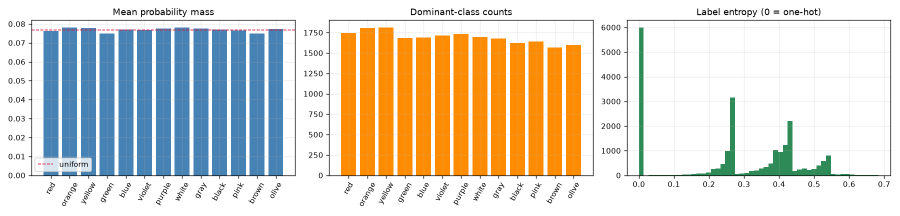
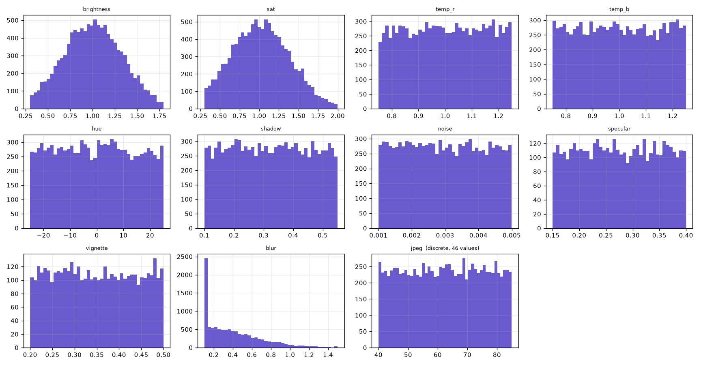
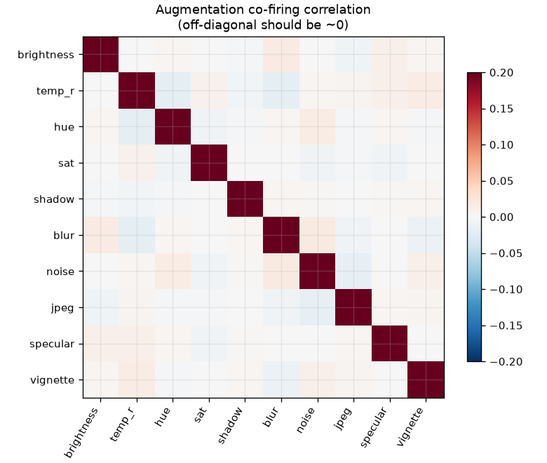
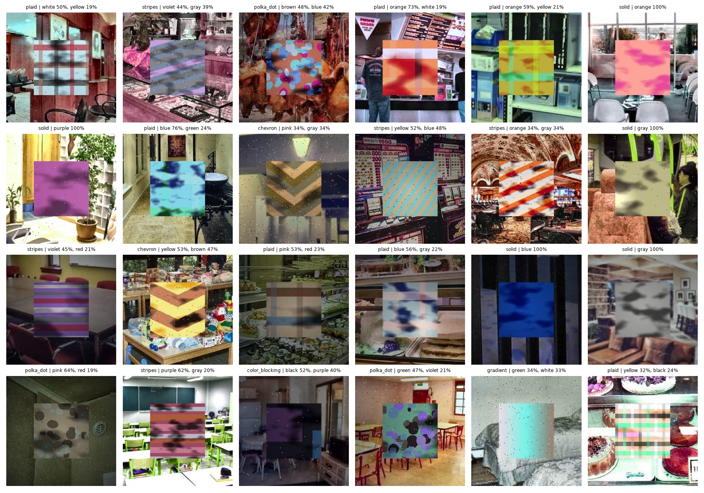

# Synthetic Dataset Audit

`datasets\generated_v3` — **28,200 images**, 36 recorded fields per image.

Every section states what it tests and what a failure would mean. Verdicts are summarised at the end.

## 1. Integrity

*Does the manifest agree with what is on disk, and is every label a valid probability distribution? A failure here invalidates everything downstream.*

| Check | Result | Status |
|---|---|---|
| Rows in labels.csv | 28,200 | — |
| Files on disk | 28,200 | OK |
| Unique filenames | 28,200 | OK |
| Unique seeds | 28,200 | OK |
| Labels sum to 1.0 | [0.999999, 1.000002] | OK |
| Labels non-negative | yes | OK |

| Split | Count |
|---|---|
| train | 20,000 |
| probe | 4,200 |
| val | 2,000 |
| test | 2,000 |

**PASS** — manifest, files, seeds and label simplex all consistent

## 2. Label space coverage

*Categories are sampled uniformly by design, so dominant-class counts should be roughly balanced. Heavy imbalance would bias the model toward over-represented colours regardless of the loss function.*

| Colour | Mean mass | Dominant count | Share |
|---|---|---|---|
| red | 0.0763 | 1,747 | 7.9% |
| orange | 0.0781 | 1,807 | 8.2% |
| yellow | 0.0778 | 1,813 | 8.2% |
| green | 0.0751 | 1,685 | 7.7% |
| blue | 0.0769 | 1,690 | 7.7% |
| violet | 0.0767 | 1,714 | 7.8% |
| purple | 0.0775 | 1,734 | 7.9% |
| white | 0.0780 | 1,697 | 7.7% |
| gray | 0.0777 | 1,675 | 7.6% |
| black | 0.0770 | 1,623 | 7.4% |
| pink | 0.0765 | 1,644 | 7.5% |
| brown | 0.0750 | 1,570 | 7.1% |
| olive | 0.0773 | 1,601 | 7.3% |

Uniform reference mass = 0.0769. Max/min dominance ratio = **1.15x**. Chi-square uniformity: stat=37.7, p=0.000174.

Label entropy: mean **0.269**, median 0.270, max 0.684. Effectively one-hot (H<0.01): **27.3%** — the remaining 72.7% are genuinely multi-modal targets, which are the samples that exercise the KL objective rather than behaving like hard labels.

**PASS** — dominance ratio 1.15x (<2.0 considered acceptable)

*Label distribution, class dominance, and target entropy*

## 3. Pattern and structure

*Patterns are drawn from fixed design weights. A significant deviation means the sampler is not doing what the configuration says.*

| Pattern | Designed | Observed | Expected | Delta |
|---|---|---|---|---|
| solid | 25% | 5,557 | 5,500 | +57 |
| stripes | 15% | 3,291 | 3,300 | -9 |
| color_blocking | 10% | 2,231 | 2,200 | +31 |
| polka_dot | 8% | 1,720 | 1,760 | -40 |
| plaid | 17% | 3,747 | 3,740 | +7 |
| gradient | 13% | 2,769 | 2,860 | -91 |
| chevron | 12% | 2,685 | 2,640 | +45 |

Chi-square goodness-of-fit: stat=5.64, p=0.465. (p > 0.05 means observed mix is consistent with design.)

**PASS** — pattern frequencies consistent with design weights (p=0.465)

Entropy by pattern — a sanity check that multi-colour patterns really do produce multi-modal labels:

| Pattern | Mean entropy | n |
|---|---|---|
| solid | 0.000 | 5,557 |
| color_blocking | 0.267 | 2,231 |
| gradient | 0.314 | 2,769 |
| stripes | 0.344 | 3,291 |
| chevron | 0.378 | 2,685 |
| plaid | 0.407 | 3,747 |
| polka_dot | 0.455 | 1,720 |

## 4. Augmentation fire rates

*Each effect fires independently with a designed probability. Observed rates outside the binomial 95% interval indicate a sampler bug.*

| Axis | Designed | Observed | Bonferroni CI | Status |
|---|---|---|---|---|
| brightness | 50% | 50.05% | [49.05%, 50.95%] | OK |
| temp_r | 50% | 49.51% | [49.05%, 50.95%] | OK |
| hue | 50% | 49.85% | [49.05%, 50.95%] | OK |
| sat | 50% | 50.25% | [49.05%, 50.95%] | OK |
| shadow | 50% | 50.10% | [49.05%, 50.95%] | OK |
| blur | 50% | 50.08% | [49.05%, 50.95%] | OK |
| noise | 50% | 49.94% | [49.05%, 50.95%] | OK |
| jpeg | 50% | 49.70% | [49.05%, 50.95%] | OK |
| specular | 20% | 20.05% | [19.24%, 20.76%] | OK |
| vignette | 20% | 19.77% | [19.24%, 20.76%] | OK |

*Intervals are Bonferroni-corrected across 10 axes (z=2.81) so the family-wise false-alarm rate is 5%, not 40%.*

**PASS** — all 10 axes fire within their family-wise 95% interval

## 5. Parameter distribution fidelity

*Firing at the right rate is not enough — the sampled values must also follow the intended distribution. A Kolmogorov-Smirnov test against the analytic reference catches a sampler that fires correctly but draws from the wrong shape (e.g. uniform where truncated-normal was intended).*

**Why each axis has the shape it does.** Peaked where the physical world has a 'correct' value it clusters around; uniform where it does not. Cameras aim for correct exposure and mostly succeed, so `brightness` and `saturation` are truncated normals. Most photographs are roughly in focus and focus error has a hard floor at zero, so `blur` is a half-normal. But there is no privileged illuminant across many rooms, no privileged compression setting, and no privileged hue offset for what is purely a regulariser — so `temperature`, `jpeg`, `hue`, `shadow`, `noise`, `specular` and `vignette` are uniform. Uniform brightness would assert that a wildly underexposed frame is as likely as a correct one, which is false about cameras and wastes model capacity on a failure mode reality rarely produces. Full reasoning in `docs/curriculum-design.md`.

**Reading the figure below.** Two axes can show spikes for entirely different reasons. `blur` has a *real* point mass: `clip()` maps every draw below 0.1 onto exactly 0.1 rather than resampling, so ~15.8% of blur values are identical. `jpeg` shows *no* real structure — it takes 46 integer values, and any bin count that is not a multiple of that produces moiré banding. Bins are now allocated per-value for discrete axes. A spiky histogram is a question, not an answer.

| Axis | Intended distribution | n | Observed range | KS p | Status |
|---|---|---|---|---|---|
| brightness | TN(1.0, 0.35) on [0.3, 1.8] | 11,012 | [0.3, 1.795] | 0.872 | OK |
| sat | TN(1.0, 0.40) on [0.3, 2.0] | 11,056 | [0.3001, 1.998] | 0.526 | OK |
| temp_r | U(0.75, 1.25) | 10,892 | [0.75, 1.25] | 0.070 | OK |
| temp_b | U(0.75, 1.25) | 10,892 | [0.75, 1.25] | 0.438 | OK |
| hue | U(-25, 25) | 10,966 | [-25, 25] | 0.012 | OK |
| shadow | U(0.10, 0.55) | 11,023 | [0.1, 0.55] | 0.419 | OK |
| noise | U(0.001, 0.005) | 10,986 | [0.001001, 0.004999] | 0.186 | OK |
| specular | U(0.15, 0.40) | 4,410 | [0.1501, 0.3997] | 0.890 | OK |
| vignette | U(0.20, 0.50) | 4,350 | [0.2001, 0.4999] | 0.446 | OK |
| blur | half-normal(0.5), clipped [0.1, 1.5] | 11,018 | [0.1, 1.5] | — | not analytic |
| jpeg | discrete uniform {40..85} | 10,933 | [40, 85] | — | not analytic |

*KS p > 0.01 means the sampled values are consistent with the intended distribution. Low p on a large sample can reflect discretisation rather than a real defect.*

**PASS** — sampled values match their intended distributions

*Sampled parameter distribution per augmentation axis*

## 6. Augmentation independence

*Effects are meant to fire independently. Correlated firing makes axes mutually unattributable — if two always co-occur, no analysis can tell which one caused a failure. This is the check that catches the V1/V2 bug where hue and saturation shared a single gate (correlation +1.0).*

Largest off-diagonal correlation: **0.0180** (blur vs noise). Noise threshold at n=22,000 is ~0.0202.

**hue vs saturation = -0.0067** — in V1/V2 this was structurally +1.000 because both sat behind one probability gate. They are now independently sampled, which is what makes per-axis attribution possible at all.

**PASS** — max |correlation| 0.0180 is within sampling noise

*Pairwise correlation of augmentation firing*

**Effects stacked per image.** Under independence this is a Poisson-binomial with mean = sum of designed probabilities:

Expected mean = 4.40, observed = **4.39** (range 0–10).

| n effects | images | share |
|---|---|---|
| 0 | 43 | 0.2% |
| 1 | 483 | 2.2% |
| 2 | 1,763 | 8.0% |
| 3 | 3,903 | 17.7% |
| 4 | 5,587 | 25.4% |
| 5 | 5,148 | 23.4% |
| 6 | 3,198 | 14.5% |
| 7 | 1,431 | 6.5% |
| 8 | 365 | 1.7% |
| 9 | 75 | 0.3% |
| 10 | 4 | 0.0% |

## 7. Colour/augmentation confounding

*The most consequential check here. Augmentation is applied after the garment colour is chosen, so the two must be statistically independent. If, say, blue garments were systematically darker, the model could reach the right answer using brightness as a proxy for colour — scoring well on this dataset while learning something that does not transfer. A leak here would invalidate the benchmark, not merely degrade it.*

| Axis | Most correlated colour | Pearson r |
|---|---|---|
| brightness | green | -0.0200 |
| temp_r | blue | +0.0158 |
| hue | green | -0.0197 |
| sat | yellow | -0.0281 |
| shadow | red | -0.0176 |
| blur | olive | +0.0223 |
| noise | blue | -0.0202 |
| jpeg | green | +0.0132 |
| specular | green | +0.0374 |
| vignette | black | -0.0285 |

Strongest leak across all 10x13 pairs: **r = +0.0374** (specular vs green). Noise floor at n=22,000 is ~0.0202.

**PASS** — max |r| = 0.0374 — augmentation carries no usable information about garment colour

## 8. Train/validation parity

*Validation must be drawn from the same distribution as training, otherwise val loss measures distribution shift rather than generalisation, and is not comparable across runs.*

| Axis | n train | n val | KS p | Verdict |
|---|---|---|---|---|
| brightness | 10,016 | 996 | 0.601 | same |
| temp_r | 9,867 | 1,025 | 0.232 | same |
| hue | 9,931 | 1,035 | 0.217 | same |
| sat | 10,048 | 1,008 | 0.936 | same |
| shadow | 10,012 | 1,011 | 0.803 | same |
| blur | 10,027 | 991 | 0.403 | same |
| noise | 10,031 | 955 | 0.809 | same |
| jpeg | 9,972 | 961 | 0.857 | same |
| specular | 4,037 | 373 | 0.960 | same |
| vignette | 3,956 | 394 | 0.297 | same |

Label entropy, train vs val: KS p = 0.391.

**PASS** — validation is distributionally indistinguishable from training

### 8b. Background isolation

*Distributional parity is not sufficient. The model sees the full 224x224 frame, not just the garment patch, so a background appearing in both train and validation is a memorisation channel — the model can recognise the room rather than generalise the colour. Backgrounds must be partitioned, not merely sampled identically.*

| Split | Unique backgrounds | Images | Reuse factor |
|---|---|---|---|
| train | 8,946 | 20,000 | 2.24x |
| val | 1,102 | 2,000 | 1.81x |
| test | 1,075 | 2,000 | 1.86x |
| probe | 1,403 | 4,200 | 2.99x |

Pairwise background overlap — every cell must be zero:

| Pair | Shared backgrounds | Status |
|---|---|---|
| train n val | 0 | OK |
| train n test | 0 | OK |
| train n probe | 0 | OK |
| val n test | 0 | OK |
| val n probe | 0 | OK |
| test n probe | 0 | OK |

**PASS** — all 6 split pairs draw from disjoint background pools — no room is ever seen by two splits

### 8c. Held-out test set

*Validation is not a clean generalisation estimate here: it drives the LR scheduler, checkpoint selection, early stopping AND the adaptive controller (class weights, augmentation strength, label smoothing). Four channels of optimisation pressure on the same 2,000 images. A separate split that nothing in the training loop ever reads is the only number that can be reported without that caveat.*

Test split: **2,000 images**, drawn from a background pool disjoint from train, val and probe.

Distributional parity with train (a test set must be representative, not merely separate):

| Axis | KS p | Verdict |
|---|---|---|
| brightness | 0.464 | same |
| temp_r | 0.003 | same |
| hue | 0.223 | same |
| sat | 0.071 | same |
| shadow | 0.083 | same |
| blur | 0.143 | same |
| noise | 0.807 | same |
| jpeg | 0.511 | same |
| specular | 0.225 | same |
| vignette | 0.029 | same |

*Holm-Bonferroni across 10 tests, family-wise alpha 0.01 (threshold 0.0000).*

**PASS** — 2,000 images, representative of train, never touched by the training loop

## 9. Probe set validity

*The probe set exists to make per-axis attribution possible. It is only valid if each image varies exactly one axis, the control group varies none, and every axis x level cell is populated evenly.*

| Check | Result | Status |
|---|---|---|
| Control images | 200 | OK |
| Control has zero augmentation | yes | OK |
| Swept images | 4,000 | — |
| Every swept image isolates 1 axis | yes | OK |
| All 10 axes covered | yes | OK |

| Axis | Levels | Images/cell | Min value | Max value | Balance |
|---|---|---|---|---|---|
| brightness | 8 | 50–50 | 0.3 | 1.8 | even |
| temperature | 8 | 50–50 | -1 | 1 | even |
| hue | 8 | 50–50 | -25 | 25 | even |
| saturation | 8 | 50–50 | 0.3 | 2 | even |
| shadow | 8 | 50–50 | 0.1 | 0.55 | even |
| blur | 8 | 50–50 | 0.1 | 1.5 | even |
| noise | 8 | 50–50 | 0.001 | 0.005 | even |
| jpeg | 8 | 50–50 | 40 | 85 | even |
| specular | 8 | 50–50 | 0.15 | 0.4 | even |
| vignette | 8 | 50–50 | 0.2 | 0.5 | even |

**PASS** — probe set supports clean single-axis attribution

## Samples

*Random training samples with dominant labels*

## Summary

| Check | Verdict | Detail |
|---|---|---|
| integrity | PASS | manifest, files, seeds and label simplex all consistent |
| label balance | PASS | dominance ratio 1.15x (<2.0 considered acceptable) |
| pattern mix | PASS | pattern frequencies consistent with design weights (p=0.465) |
| fire rates | PASS | all 10 axes fire within their family-wise 95% interval |
| parameter fidelity | PASS | sampled values match their intended distributions |
| independence | PASS | max |correlation| 0.0180 is within sampling noise |
| no colour confound | PASS | max |r| = 0.0374 — augmentation carries no usable information about garment colour |
| train/val parity | PASS | validation is distributionally indistinguishable from training |
| background isolation | PASS | all 6 split pairs draw from disjoint background pools — no room is ever seen by two splits |
| held-out test set | PASS | 2,000 images, representative of train, never touched by the training loop |
| probe validity | PASS | probe set supports clean single-axis attribution |

**11 of 11 checks passed.**

The dataset is internally consistent, matches its design specification, and carries no measurable colour/augmentation confound. It is suitable as a benchmark.

